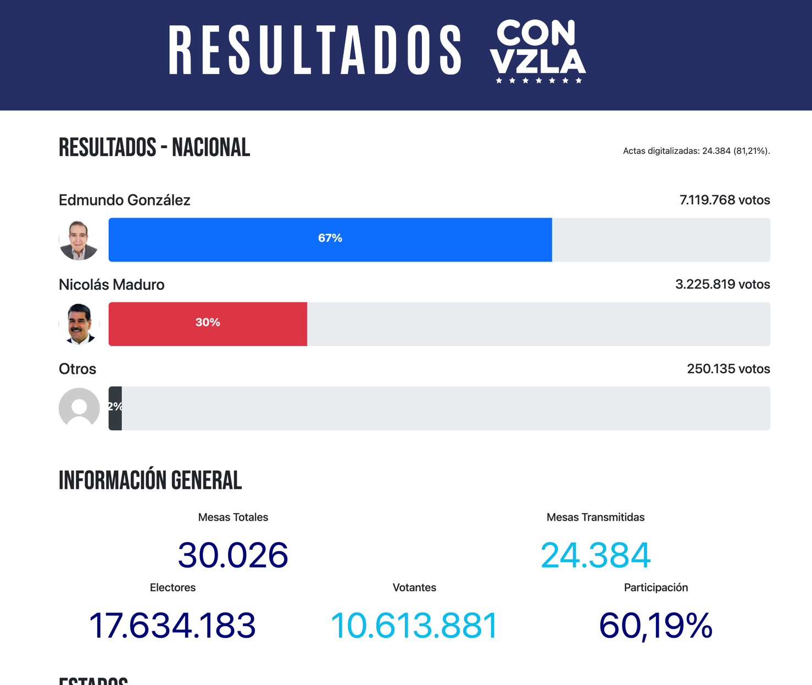

### Scraper de la página https://resultadosconvzla.com/



### Nota 

Para evitar saturar la página web, aquí adjunto los links directos para la descarga

#### https://www.mediafire.com/folder/p1i5nx46yktay/Documents

Pesan unos 12 GB  y son 24 mil archivos en formato jpeg sin comprimir para mantener la calidad original

### Descripción

Este scraper fue creado para descargar masivamente las actas electorales de las elecciones presidenciales de Venezuela del 24 de Julio del 2024. 

La página web https://resultadosconvzla.com/ contiene las actas de todas las mesas electorales del país, pero no permite descargarlas de forma masiva. Este scraper descarga todas las actas de todas las mesas electorales y las guarda en una carpeta local.

### Corriendo el scraper

Es necesario tener instalado Golang 1.22 o superior.

Para correr el scraper, se debe ejecutar el siguiente comando:

```bash
go run scripts/download.go
```

Para crear los zips

```bash
go run scripts/create_zips.go
```


###

La idea detrás de este repo es poder tener un respaldo de las actas electorales en caso de que la página web sea eliminada o modificada.

La siguiente funcionalidad del scraper será tomar estas actas y extraer la información de manera masiva usando el QR.

Luego comparar la información del QR con la arrojada en el acta.

Cuando el gobierno asesino publique sus resultados este comparador ayudará a conseguir diferencias de forma masiva.

